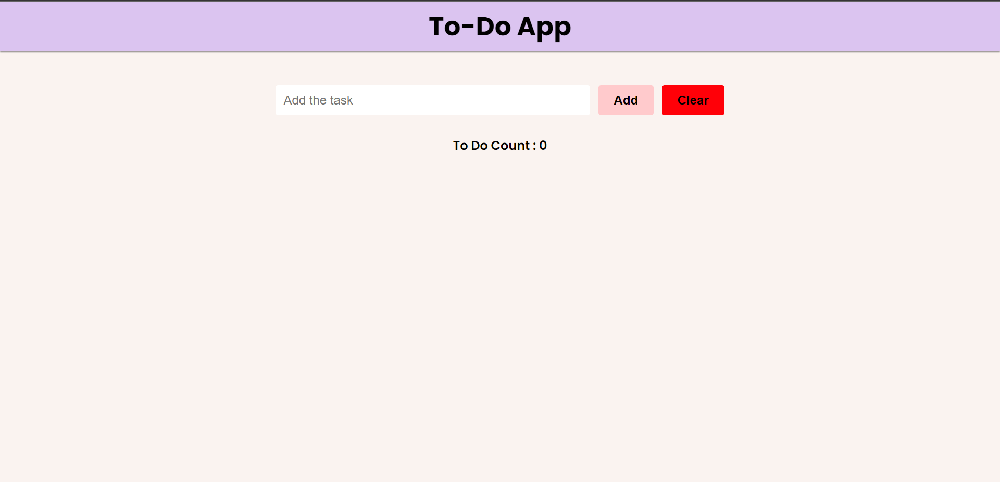

# ToDo App

This is a simple ToDo App built using HTML, CSS, and JavaScript. The app allows you to add, edit, and remove tasks from your to-do list.

## Features

- Add tasks: Enter a task in the input field and click the "Add" button to add it to your to-do list.
- Edit tasks: Click the "Edit" button next to a task to modify its content.
- Remove tasks: Click the "Remove" button to delete a task from the list.
- Clear all tasks: Click the "Clear" button to remove all tasks from the list.

## Getting Started

1. Clone the repository: `git clone https://github.com/jain-rithik/Todo-App.git`
2. Open the `index.html` file in your browser.

## App Preview

## Technologies Used

- HTML
- CSS
- JavaScript

